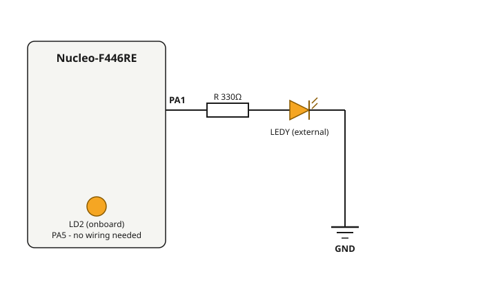

# 1 — Blink LED (dual LED, non-blocking timing)

**Board:** Nucleo-F446RE (STM32F446RETx)
**IDE:** STM32CubeIDE (GCC / make)

## What this project is about

The classic "hello world" of embedded programming, extended just enough to teach a real technique: **non-blocking timing**.

The project blinks two LEDs at two different rates at the same time:
- **LD2** — the LED already built into the Nucleo board (pin PA5). No wiring needed.
- **LEDY** — an external LED wired to pin PA1.

A naive implementation would use `HAL_Delay()` to blink each LED, but `HAL_Delay()` **blocks** the CPU — if you call it for LD2, LEDY cannot blink at the same time. This project instead polls `HAL_GetTick()` (the millisecond counter running off SysTick) and toggles each LED only when *its own* interval has elapsed, so both LEDs blink independently in the same `while(1)` loop.

```c
if (HAL_GetTick() - last_toggle_ld2 >= 500)  { HAL_GPIO_TogglePin(LD2_GPIO_Port, LD2_Pin); last_toggle_ld2 = HAL_GetTick(); }
if (HAL_GetTick() - last_toggle_ledy >= 1000) { HAL_GPIO_TogglePin(LEDY_GPIO_Port, LEDY_Pin); last_toggle_ledy = HAL_GetTick(); }
```

This "record a timestamp, then keep checking elapsed time on every loop" pattern is the foundation every later project in this repository builds on (debounce timers, double-click windows, long-press detection).

## Pin mapping

| Signal | Pin | Notes |
|---|---|---|
| `LD2` | PA5 | Onboard user LED, no external wiring |
| `LEDY` | PA1 | External LED, active-high through a series resistor |

## Wiring diagram



LD2 needs no wiring at all — it is already connected to PA5 on the board. Only `LEDY` needs an external circuit: PA1 → resistor (≈330Ω) → LED anode, LED cathode → GND.

## CubeMX setup & code generation

1. `File → New → STM32 Project` → Board Selector → search **NUCLEO-F446RE** → select it → Next → finish the wizard (accepts the board's default clock/pin initialization).
2. In the **Pinout & Configuration** view, click pin **PA1** on the chip diagram → set it to `GPIO_Output`. In the pin's parameter panel (bottom), set **User Label** to `LEDY`.
3. `PA5` is already `GPIO_Output` labeled `LD2` automatically, since the board selector recognizes it as the Nucleo's onboard user LED — nothing to change there.
4. **Project Manager** tab → **Project** → confirm **Toolchain / IDE** is set to `STM32CubeIDE`.
5. **Project Manager → Code Generator** → select **`Copy only the necessary library files`** (not "Copy all used libraries files" — the latter pulls in unrelated CMSIS submodules that fail to compile).
6. Click **GENERATE CODE** (top-right). CubeIDE opens/imports the project automatically if it's already running.

## What to look at in the code

`Core/Src/main.c` — `MX_GPIO_Init()` configures both pins as `GPIO_MODE_OUTPUT_PP`; the two independent timers live in the `while(1)` loop.
