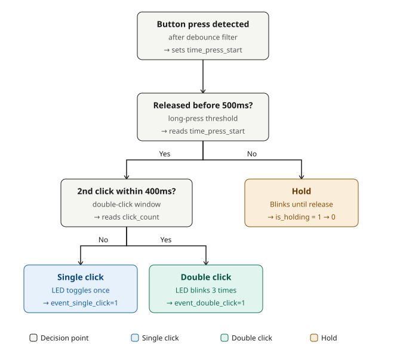

# 2 — Button (polling, debounce, single/double click, long-press)

**Board:** Nucleo-F446RE (STM32F446RETx)
**IDE:** STM32CubeIDE (GCC / make)

## What this project is about

A single push button, three behaviors:

1. **Single click** (press and release once) → LED toggles once.
2. **Double click** (press-release twice within 400ms) → LED blinks 3 times.
3. **Long press / hold** (held down longer than 500ms) → LED blinks continuously until released, then turns off.

The button is read by **polling**: the main `while(1)` loop calls `HAL_GPIO_ReadPin()` on every iteration to check the current pin state — no interrupts are used in this project. That comparison matters pedagogically: [3_1_Button_Interupt](../3_1_Button_Interupt) and [3_2_Button_Interrupt](../3_2_Button_Interrupt) solve the exact same problem using EXTI interrupts instead, so the two approaches can be compared side by side.

## Why this is harder than it looks: mechanical bounce

A real push button does not produce one clean electrical transition when pressed — the metal contacts physically bounce, producing several rapid on/off transitions within a few milliseconds. Reading the raw pin directly would register a single human press as several presses.

The fix is a **non-blocking debounce filter**: every time the raw pin reading changes, restart a 15ms timer. Only once the reading has stayed *stable* for the full 15ms is the new state trusted and copied into `button_current`. This never blocks the CPU — it is checked once per loop using the same `HAL_GetTick()` timestamp-comparison pattern from [1_Blink_LED](../1_Blink_LED).

## State machine



The classification logic on top of the debounced signal:
- On press, `time_press_start` is recorded.
- On release: if it had crossed the 500ms hold threshold, it's a **hold**, not a click. Otherwise it counts toward `click_count`; if a second release arrives within 400ms (`DOUBLE_CLICK_WINDOW_MS`) it's a **double click**, otherwise the 400ms window quietly expires and it resolves to a **single click**.
- Detection (`Button_Handle()`) and LED reaction (`LED_Handle()`) are two separate functions: the first only sets flags (`event_single_click`, `event_double_click`, `is_holding`), the second only reacts to them. This separation means the LED's behavior could be replaced (a buzzer, a UART message, anything) without touching a single line of button-detection logic.

## Pin mapping

| Signal | Pin | Notes |
|---|---|---|
| `Button` | PC0 (Arduino header A5) | Input, internal pull-up enabled — idle = HIGH, pressed = LOW |
| `LEDY` | PC1 (Arduino header A4) | Output, active-high through a series resistor |

## Wiring diagram


The button needs no external resistor — `GPIO_PULLUP` is enabled in software (`MX_GPIO_Init()`), so one leg of the button goes straight to PC0 and the other to GND.

## CubeMX setup & code generation

1. `File → New → STM32 Project` → Board Selector → **NUCLEO-F446RE** → Next → finish the wizard.
2. Click pin **PC0** → set it to `GPIO_Input`. In the parameter panel: **GPIO Pull-up/Pull-down** = `Pull-up`, **User Label** = `Button`.
3. Click pin **PC1** → set it to `GPIO_Output`. **User Label** = `LEDY`.
4. **Project Manager → Project** → Toolchain / IDE = `STM32CubeIDE`.
5. **Project Manager → Code Generator** → **`Copy only the necessary library files`**.
6. **GENERATE CODE**.

## Folder structure

```
2_Button/
├── Core/Src/main.c       - MX_GPIO_Init, while(1) loop calling Button_Handle()+LED_Handle()
├── lib/button.c/.h       - debounce + single/double/hold state machine
├── lib/led.c/.h          - LED reaction to the flags set by button.c
├── Button.ioc            - CubeMX pin configuration
└── wiring_diagram.svg
```
