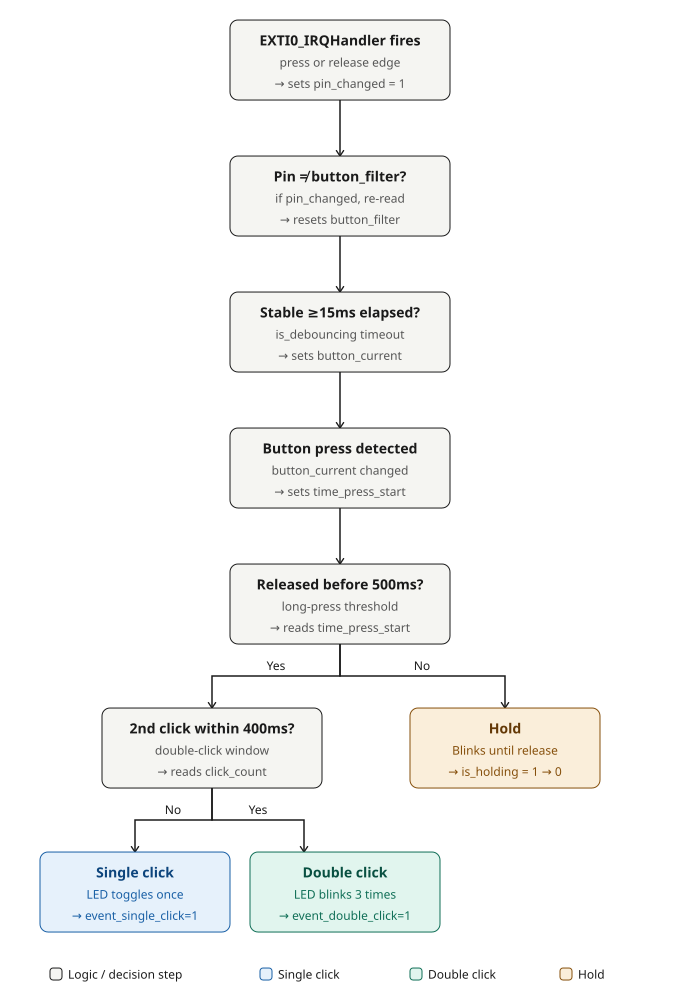

# 3.1 — Button + Interrupt (modular, EXTI dispatcher)

**Board:** Nucleo-F446RE (STM32F446RETx)
**IDE:** STM32CubeIDE (GCC / make)

## What this project is about

The same three button behaviors as [2_Button](../2_Button) — single click, double click, long-press — but the button edge is now detected with a **hardware interrupt (EXTI)** instead of polling `HAL_GPIO_ReadPin()` every loop iteration.

This version also introduces a **dispatcher pattern**: instead of `main.c` knowing the name of every module's interrupt callback, each module registers its own callback for a specific pin once at startup, and a generic dispatcher looks up and calls the right one when that pin's interrupt fires. This is the version to read if the next step is adding a *second* interrupt source (an encoder, another button, a sensor) — see [3_2_Button_Interrupt](../3_2_Button_Interrupt) for the simpler, single-button version without this extra layer.

## Interrupt vs. polling

Polling (`2_Button`) means the CPU asks "did the pin change?" thousands of times a second, almost always getting "no". An interrupt means the GPIO hardware itself notifies the CPU only when a real edge (rising or falling) happens on the pin — the CPU is free to do other work in between.

One thing does **not** change with interrupts: mechanical bounce still happens, and the 15ms debounce filter is still required — a raw edge only tells you *something* changed, not that it has settled. The interrupt callback here does the absolute minimum (`pin_changed = 1`), and the actual debounce/classification logic still runs in the main loop, checked every iteration via `HAL_GetTick()`.

## Architecture



```
EXTI0_IRQHandler (hardware vector)
  → HAL_GPIO_EXTI_IRQHandler()
    → HAL_GPIO_EXTI_Callback()  (in main.c, overrides HAL's weak default)
      → EXTI_Dispatcher_Handle(GPIO_Pin)
        → looks up a 16-slot table (one per EXTI line) and calls
          whichever callback was registered for that pin
            → Button_EXTI_Callback()  (in lib/button.c) sets pin_changed = 1
```

`main()` registers the button once at startup:
```c
EXTI_Dispatcher_Register(Button_Pin, Button_EXTI_Callback);
```
Adding a second interrupt source later means writing its own `lib/<module>.c` with a matching callback and adding one more `EXTI_Dispatcher_Register(...)` line — `HAL_GPIO_EXTI_Callback()` in `main.c` never needs to change.

## CubeMX setup & code generation

1. `File → New → STM32 Project` → Board Selector → **NUCLEO-F446RE** → Next → finish the wizard.
2. Click pin **PC0** → set it to `GPIO_EXTI0` (interrupt on that line). In the parameter panel: **GPIO Pull-up/Pull-down** = `Pull-up`, **User Label** = `Button`, **GPIO Mode** = `External Interrupt Mode with Rising/Falling edge trigger detection` (both edges — a long-press needs the *release* edge too, not just the press).
3. Click pin **PC1** → set it to `GPIO_Output`. **User Label** = `LEDY`.
4. **System Core → NVIC** tab → confirm **EXTI line0 interrupt** is enabled (ticking `GPIO_EXTI0` on a pin enables this automatically).
5. **Project Manager → Project** → Toolchain / IDE = `STM32CubeIDE`.
6. **Project Manager → Code Generator** → **`Copy only the necessary library files`**.
7. **GENERATE CODE**.

## Pin mapping

| Signal | Pin | Notes |
|---|---|---|
| `Button` | PC0 (Arduino header A5) | `GPIO_MODE_IT_RISING_FALLING`, internal pull-up — both press and release generate an interrupt |
| `LEDY` | PC1 (Arduino header A4) | Output, active-high through a series resistor |

## Wiring diagram


Physically identical wiring to `2_Button` — the difference between the two projects is entirely in software (how the button edge is detected), not in the circuit.

## Folder structure

```
3_1_Button_Interupt/
├── Core/Src/main.c              - MX_GPIO_Init (EXTI0 + NVIC), HAL_GPIO_EXTI_Callback override
├── Core/Src/stm32f4xx_it.c      - EXTI0_IRQHandler
├── lib/exti_dispatcher.c/.h     - pin -> callback lookup table
├── lib/button.c/.h              - debounce + single/double/hold state machine
├── lib/led.c/.h                 - LED reaction to button.c's flags
├── Interupt.ioc                 - CubeMX pin configuration
└── wiring_diagram.svg
```
