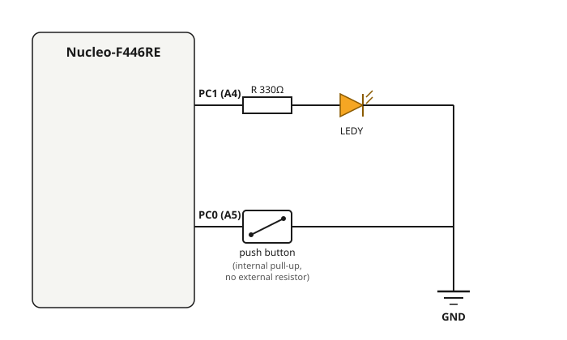

# 3.2 — Button + Interrupt (guided, single-file build)

**Board:** Nucleo-F446RE (STM32F446RETx)
**IDE:** STM32CubeIDE (GCC / make)

## What this project is about

The same interrupt-driven single/double click + long-press behavior as [3_1_Button_Interupt](../3_1_Button_Interupt), but built as a **step-by-step teaching path** rather than a finished modular architecture. Everything lives in one file, `Core/Src/main.c` — no `lib/` split, no dispatcher. This is the recommended project to *build from scratch with a student*, one stage at a time; `3_1_Button_Interupt` is the recommended project to show *afterwards*, as "here is how you'd restructure this once it needs to scale to more than one interrupt source."

## Suggested build order (how this project was actually developed)

Each stage should compile and be tested on real hardware before moving to the next — debugging is far easier when only one new piece of behavior was just added.

1. **CubeMX pin config only** — `PC1` as `GPIO_Output`, `PC0` as `GPIO_EXTI0` with pull-up and **both-edge** trigger (`GPIO_MODE_IT_RISING_FALLING` — a long-press needs to detect the *release* edge too, not just the press), NVIC EXTI0 enabled. Nothing else yet.
2. **Raw LED test** — blink the LED with `HAL_Delay()` in `while(1)`, no button involved. Confirms the LED wiring/pin config alone, before adding any interrupt complexity on top.
3. **Raw interrupt test** — `HAL_GPIO_EXTI_Callback()` just toggles the LED on every edge. Confirms the entire interrupt chain works (vector name, NVIC enable, callback override) before writing any real logic on top of it.
4. **Debounce** — the callback only sets a flag (`pin_changed = 1`); a non-blocking 15ms timer in `Button_Handle()` confirms the pin has actually settled before trusting it.
5. **Click/hold state machine** — `click_count`, `time_first_click`, `is_holding`, `time_press_start` classify the debounced signal into single click / double click / hold.
6. **Separate `LED_Handle()`** — button detection and LED reaction split into two functions so each has one reason to change.

## Interrupt vs. polling

See [2_Button](../2_Button) for the polling version of this exact same problem. The short version: an interrupt lets the GPIO hardware notify the CPU only when a real edge happens, instead of the CPU asking "did it change?" on every loop iteration — but mechanical bounce still means a 15ms debounce filter is required regardless of how the edge was detected.

## Logic


`HAL_GPIO_EXTI_Callback()` does the minimum possible (`pin_changed = 1`); everything else — debounce, click counting, hold detection, LED reaction — runs in `Button_Handle()` / `LED_Handle()` inside the main loop, using the same "record a timestamp, keep checking elapsed time" pattern used throughout this repository.

## CubeMX setup & code generation

1. `File → New → STM32 Project` → Board Selector → **NUCLEO-F446RE** → Next → finish the wizard.
2. Click pin **PC0** → set it to `GPIO_EXTI0`. In the parameter panel: **GPIO Pull-up/Pull-down** = `Pull-up`, **User Label** = `Button`, **GPIO Mode** = `External Interrupt Mode with Rising/Falling edge trigger detection`.
3. Click pin **PC1** → set it to `GPIO_Output`. **User Label** = `LEDY`.
4. **System Core → NVIC** tab → confirm **EXTI line0 interrupt** is enabled.
5. **Project Manager → Project** → Toolchain / IDE = `STM32CubeIDE`.
6. **Project Manager → Code Generator** → **`Copy only the necessary library files`**.
7. **GENERATE CODE**.

## Pin mapping

| Signal | Pin | Notes |
|---|---|---|
| `Button` | PC0 (Arduino header A5) | `GPIO_MODE_IT_RISING_FALLING`, internal pull-up |
| `LEDY` | PC1 (Arduino header A4) | Output, active-high through a series resistor |

## Wiring diagram



## Folder structure

```
3_2_Button_Interrupt/
├── Core/Src/main.c          - everything: MX_GPIO_Init, HAL_GPIO_EXTI_Callback,
│                               Button_Handle(), LED_Handle(), while(1) loop
├── Core/Src/stm32f4xx_it.c  - EXTI0_IRQHandler
├── Interrupt.ioc            - CubeMX pin configuration
└── wiring_diagram.svg
```
