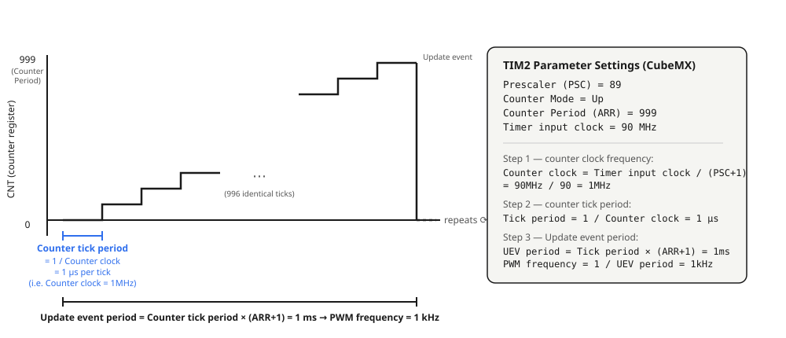
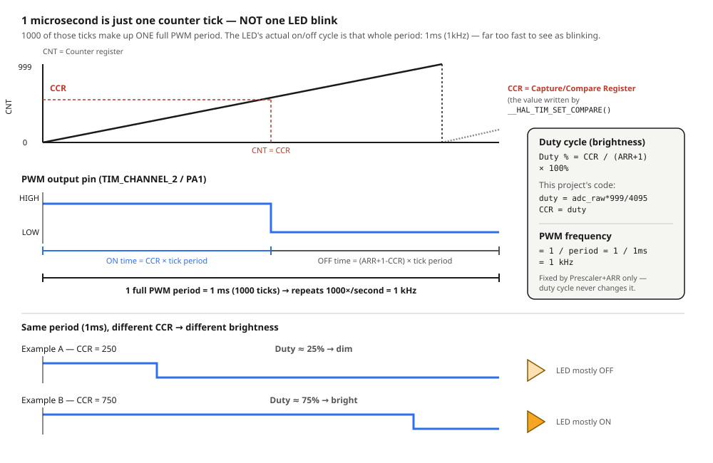

# 4.1 — ADC Single Channel + PWM LED (potentiometer → brightness)

**Board:** Nucleo-F446RE (STM32F446RETx)
**IDE:** STM32CubeIDE (GCC / make)

## What this project is about

A 10kΩ potentiometer is read on a single ADC channel, and its value directly controls the brightness of an LED through PWM — turn the knob, the LED dims or brightens in real time. This is the first project in the repository combining two peripherals: **ADC** (reading an analog voltage) and **timer PWM** (generating an analog-like output).

## CubeMX setup & code generation

1. `File → New → STM32 Project` → Board Selector → **NUCLEO-F446RE** → Next → finish the wizard.
2. Click pin **PA0** → set it to `ADC1_IN0`.
3. **Analog → ADC1** tab: tick only `IN0` (single channel, no Scan Mode). Parameter Settings: **Resolution** = `12-bit`, **Data Alignment** = `Right Alignment`, **Continuous Conversion Mode** = `Disabled`, **Sampling Time** (channel 0) = `56 Cycles`.
4. Click pin **PA1** → set it to `TIM2_CH2`.
5. **Timers → TIM2** tab → **Channel2** = `PWM Generation CH2`. Parameter Settings: **Prescaler** = `89`, **Counter Period (ARR)** = `999`, **Pulse** = `0`.
6. **Project Manager → Project** → Toolchain / IDE = `STM32CubeIDE` (generating with the wrong toolchain, e.g. EWARM/IAR, produces a project STM32CubeIDE's Import wizard can't see — no `.project`/`.cproject`).
7. **Project Manager → Code Generator** → **`Copy only the necessary library files`** (not "Copy all used libraries files" — that pulls in unrelated CMSIS submodules like RTOS2/NN/DSP that fail to compile since their supporting middleware isn't generated).
8. **GENERATE CODE**.

## How the ADC read works

The ADC is configured for **single conversion mode** (`ContinuousConvMode = DISABLE`), so every reading needs an explicit start/poll/stop cycle — the pattern repeats every loop iteration:

```c
HAL_ADC_Start(&hadc1);
HAL_ADC_PollForConversion(&hadc1, HAL_MAX_DELAY);   // blocks until EOC flag is set
adc_raw = HAL_ADC_GetValue(&hadc1);                  // read the DR register, 0-4095 (12-bit)
HAL_ADC_Stop(&hadc1);
```

`HAL_ADC_PollForConversion` blocks the CPU while the ADC hardware samples and converts — this is fine here since a single conversion takes only a few microseconds and the loop has nothing else time-critical to do.

## How the PWM output works

TIM2 channel 2 is configured once at startup (not re-started every loop):

```c
HAL_TIM_PWM_Start(&htim2, TIM_CHANNEL_2);   // called once, before while(1)
```

With `Prescaler = 89` and `Period (ARR) = 999`, the timer clock (90MHz APB1 timer clock ÷ 90) produces a 1kHz PWM signal. Every loop iteration just rewrites the compare register — the timer keeps outputting the PWM signal in hardware, no CPU polling needed for the output side:

```c
duty = adc_raw * 999 / 4095;                          // map 0-4095 -> 0-999
__HAL_TIM_SET_COMPARE(&htim2, TIM_CHANNEL_2, duty);    // writes TIM2->CCR2 directly
```

## Why Prescaler (PSC) = 89 and Counter Period (ARR) = 999

These are the exact parameter names shown in CubeMX under **Timers → TIM2 → Parameter Settings**:

| CubeMX parameter | Value |
|---|---|
| Prescaler (PSC - 16 bits value) | `89` |
| Counter Mode | `Up` |
| Counter Period (AutoReload Register - 16 bits value) | `999` |

The `CNT` counter register is a free-running counter driven entirely by hardware: every **counter tick period** it increments by 1, and once it reaches the Counter Period it rolls back to 0 and generates an **Update event** — the cycle repeats.

```
Counter clock       = Timer input clock / (Prescaler + 1)     // frequency, in Hz
Counter tick period = 1 / Counter clock                        // time for CNT to increment by 1
Update event period = Counter tick period × (Counter Period + 1)   // time for one full 0 -> ARR -> 0 cycle
PWM frequency        = 1 / Update event period
```



Plugging in this project's numbers — TIM2 sits on the APB1 bus, and this board's clock configuration gives a **Timer input clock = 90MHz** (APB1 Timer clock):

```
Counter clock        = 90,000,000 / (89 + 1) = 1,000,000 Hz = 1MHz
Counter tick period  = 1 / 1,000,000 = 1 µs                    // CNT increments once every microsecond
Update event period  = 1µs × (999 + 1) = 1000µs = 1ms
PWM frequency         = 1 / 1ms = 1kHz
```

`Prescaler = 89` was picked specifically to land on a clean `Counter clock = 1MHz` (1µs per tick) — easy to reason about. `Counter Period = 999` then gives exactly 1000 steps of duty-cycle resolution (0-999, matching the `adc_raw * 999 / 4095` mapping used below) and a 1ms Update event period — fast enough (1kHz) that the LED never visibly flickers.

**1 microsecond is not one LED blink** — it's easy to misread it that way, but it's just how often the counter *ticks* internally. 1000 of those ticks make up a single PWM period. The LED's actual on/off cycle is the *whole* period: 1ms, i.e. 1kHz — repeating 1000 times every second, far above the ~50-60Hz the eye can resolve as flicker, which is why it reads as a steady brightness instead of a blink.

## How duty cycle (brightness) and PWM frequency are calculated

`CNT` ramps from 0 up to the Counter Period once every PWM period. The `CCR` (Capture/Compare Register) holds the value written by `__HAL_TIM_SET_COMPARE()`. In `PWM mode 1` with `OCPolarity = High` (this project's setting), the output pin is driven **HIGH while `CNT < CCR`**, then **LOW for the rest of the period** once `CNT` reaches `CCR`:



```
Duty cycle (%) = CCR / (Counter Period + 1) × 100%
PWM frequency  = 1 / Update event period          // fixed by Prescaler + Counter Period only
```

The **PWM frequency never changes** as the potentiometer is turned — it's baked into `Prescaler`/`Counter Period` at startup. Only `CCR` (i.e. `duty`) changes every loop iteration, which changes the **duty cycle**, i.e. how much of each fixed 1ms period the LED spends ON — that's the only thing perceived as brightness changing.

## Pin mapping

| Signal | Pin | Notes |
|---|---|---|
| Potentiometer wiper | PA0 (Arduino header **A0**), `ADC1_IN0` | Analog input, 12-bit, single channel, software-triggered |
| LEDY (PWM) | PA1 (Arduino header **A1**), `TIM2_CH2` | Alternate function output, 1kHz PWM |

## Wiring diagram


- Potentiometer (10kΩ linear, marked **B103**): outer pins to `3V3` and `GND` (either way round works — reversing them just flips which direction feels like "increase"), wiper (middle pin) to `PA0`.
- LEDY: `PA1` → resistor (~330Ω) → LED anode, LED cathode → `GND`.

## Debugging with Live Expressions

`adc_raw` (and `duty`) are inspected live during a debug session using CubeIDE's **Live Expressions** view, which polls a global/static variable's value over SWD while the target keeps running (no breakpoint needed):

1. Start a debug session, open `Window → Show View → Live Expressions`.
2. Add `adc_raw` (and `duty`) as an expression.
3. Toggle **Enable Live Watch** on the view's toolbar, then **Resume** the target.

## Folder structure

```
4_1_ADC_LED/
├── Core/Src/main.c            - MX_ADC1_Init, MX_TIM2_Init, while(1) loop reading ADC and writing PWM compare
├── 4_1_ADC_LED.ioc             - CubeMX project (ADC1 IN0 single channel, TIM2 CH2 PWM, Toolchain: STM32CubeIDE)
├── wiring_diagram.svg
├── timer_prescaler_diagram.svg - how Prescaler/Counter Period turn the timer clock into 1kHz
└── pwm_duty_diagram.svg        - how CCR sets the duty cycle (brightness)
```
