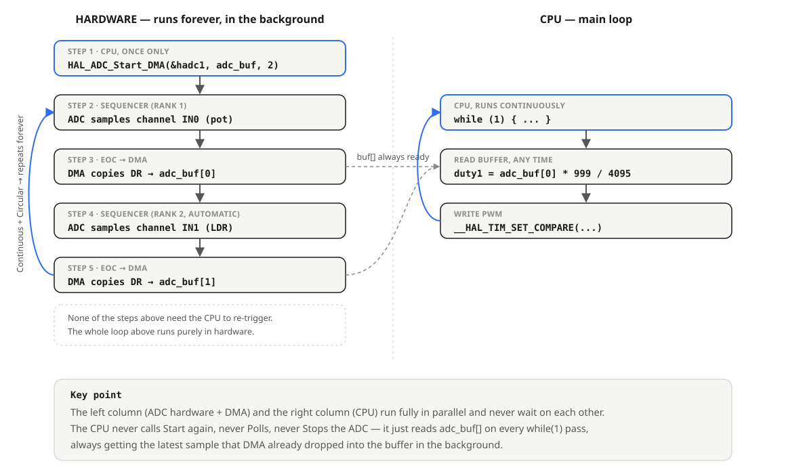
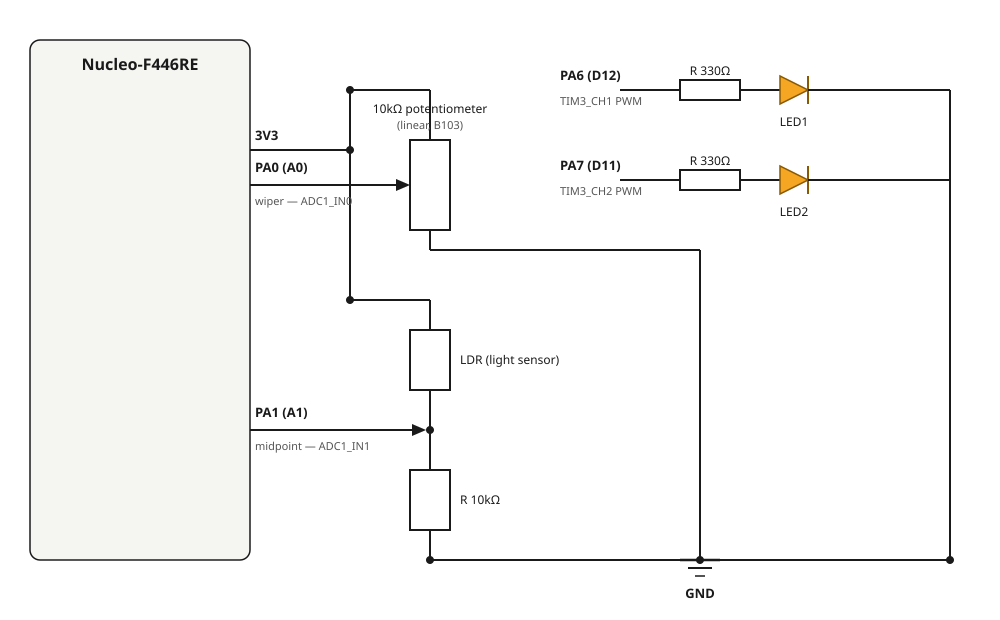

# 4.2 — Multi-channel ADC (true hardware scan + DMA) + 2 LED PWM

**Board:** Nucleo-F446RE (STM32F446RETx)
**IDE:** STM32CubeIDE (GCC / make)

## What this project is about

Two analog inputs — a potentiometer and a light-dependent resistor (LDR) — are read on the **same ADC** at the same time, using **hardware scan mode + DMA**. Each channel independently drives the brightness of its own LED through PWM: LED1 follows the potentiometer, LED2 follows ambient light.

This is the true multi-channel technique contrasted with [4_1_ADC_LED](../4_1_ADC_LED)'s single-channel read and with the sequential-polling trick some sample code uses (reconfiguring and re-triggering a single-channel read function once per channel, in a loop). Here, the ADC hardware itself cycles through both channels on its own; the CPU never calls `HAL_ADC_Start()` more than once.

## How ADC scan + DMA works



The **regular group sequencer** inside the ADC holds a small ordered list of channels (a "rank" table — Rank 1 = channel 0, Rank 2 = channel 1, configured in CubeMX). With **Scan Mode** enabled, a single `HAL_ADC_Start_DMA()` call makes the ADC step through the whole rank list on its own — no software re-trigger between channels. With **Continuous Mode** enabled, once the last rank finishes, the sequencer loops back to rank 1 and starts over, forever.

Each time a conversion finishes, the **DMA controller** (not the CPU) copies the result out of the `ADC1->DR` register into a RAM array. With DMA **Circular** mode, once it has written both array slots it wraps back to the start — staying in sync with the ADC sequencer's own wraparound.

```c
uint16_t adc_buf[2] = {0};   // adc_buf[0] = IN0 (pot), adc_buf[1] = IN1 (LDR)

HAL_ADC_Start_DMA(&hadc1, (uint32_t*)adc_buf, 2);   // called once, before while(1)
```

From this point on, `adc_buf[]` keeps updating itself in the background at hardware speed. The `while(1)` loop never calls `Start`, `PollForConversion`, `GetValue`, or `Stop` — it just reads whatever is already sitting in `adc_buf[]`.

## How the two independent PWM outputs work

Same PWM pattern as [4_1_ADC_LED](../4_1_ADC_LED), just on two channels of the same timer (TIM3) instead of one:

```c
HAL_TIM_PWM_Start(&htim3, TIM_CHANNEL_1);   // LED1, called once
HAL_TIM_PWM_Start(&htim3, TIM_CHANNEL_2);   // LED2, called once

while (1)
{
  duty1 = adc_buf[0] * 999 / 4095;   // map pot reading -> 0-999
  duty2 = adc_buf[1] * 999 / 4095;   // map LDR reading -> 0-999
  __HAL_TIM_SET_COMPARE(&htim3, TIM_CHANNEL_1, duty1);
  __HAL_TIM_SET_COMPARE(&htim3, TIM_CHANNEL_2, duty2);
}
```

With `Prescaler = 89` and `Period (ARR) = 999`, the 90MHz APB1 timer clock is divided down to a 1kHz PWM signal on both channels — fast enough that neither LED visibly flickers.

## Pin mapping

| Signal | Pin | Notes |
|---|---|---|
| Potentiometer wiper | PA0-WKUP (Arduino header **A0**), `ADC1_IN0` | Rank 1 |
| LDR divider midpoint | PA1 (Arduino header **A1**), `ADC1_IN1` | Rank 2 |
| LED1 (PWM) | PA6 (Arduino header **D12**), `TIM3_CH1` | 1kHz PWM, follows the potentiometer |
| LED2 (PWM) | PA7 (Arduino header **D11**), `TIM3_CH2` | 1kHz PWM, follows the LDR |

## Wiring diagram



- **Potentiometer** (10kΩ linear, marked **B103**): outer pins to `3V3` and `GND`, wiper (middle pin) to `PA0`.
- **LDR divider**: `3V3` → LDR → node → 10kΩ fixed resistor → `GND`. The node (junction between the LDR and the fixed resistor) goes to `PA1`. The LDR sits on the 3V3 side on purpose: `V(PA1) = 3.3V × R_fixed / (R_LDR + R_fixed)` — as light increases, `R_LDR` drops, so the reading goes *up* with brightness, which is the intuitive direction to debug against.
- **LED1 / LED2**: `PA6`/`PA7` → 330Ω resistor → LED anode, LED cathode → `GND`.

An LDR only has 2 legs (unlike the potentiometer, which has 3 and forms its own built-in divider) — the fixed 10kΩ resistor is what turns its resistance change into a voltage change the ADC can actually read. Without it, the ADC pin would sit pinned near 3V3 regardless of light level, the same failure mode as a miswired GND: a reading that never changes no matter what you do to the sensor.

## CubeMX setup & code generation

1. `File → New → STM32 Project` → Board Selector → **NUCLEO-F446RE** → Next → finish the wizard.
2. Click pin **PA0** → set it to `ADC1_IN0`. Click pin **PA1** → set it to `ADC1_IN1`.
3. Click pin **PA6** → set it to `TIM3_CH1`. Click pin **PA7** → set it to `TIM3_CH2`.
4. **Analog → ADC1** tab: tick `IN0` and `IN1`. Parameter Settings:
   - **Scan Conversion Mode** = `Enabled`
   - **Continuous Conversion Mode** = `Enabled`
   - **DMA Continuous Requests** = `Enabled` — easy to miss, and without it DMA only ever performs one full scan at startup and then stops updating the buffer, even though the ADC keeps converting
   - **Resolution** = `12-bit`, **Data Alignment** = `Right Alignment`
   - **Number Of Conversion** = `2`
   - Rank 1: Channel = `IN0`, Sampling Time = `56 Cycles`
   - Rank 2: Channel = `IN1`, Sampling Time = `56 Cycles`
5. Still inside ADC1's configuration, **DMA Settings** tab → **Add** → adds an `ADC1` DMA request. Configure it:
   - **Mode** = `Circular` (without this, DMA also stops after one pass)
   - **Data Width**: Peripheral = `Half Word`, Memory = `Half Word`
   - **Memory** → tick **Increment Address** (Peripheral → leave unticked, `ADC1->DR`'s address never changes)
6. **Timers → TIM3** tab → **Channel1** = `PWM Generation CH1`, **Channel2** = `PWM Generation CH2`. Parameter Settings: **Prescaler** = `89`, **Counter Period (ARR)** = `999` (not the CubeMX default of `65535` — that produces a ~15Hz PWM signal, slow enough to see the LED visibly flicker instead of smoothly dimming), **Pulse** = `0` for both channels.
7. **Project Manager → Project** → Toolchain / IDE = `STM32CubeIDE`.
8. **Project Manager → Code Generator** → **`Copy only the necessary library files`** (not "Copy all used libraries files" — that pulls in unrelated CMSIS submodules — `DAP`, `Core_A`, `Core/Template/ARMv8-M`, `RTOS2`, `NN`, `DSP` depending on what CubeMX decides to bundle — that fail to compile since their supporting middleware isn't generated).
9. **GENERATE CODE**.

## Code — build in stages, test on hardware after each one

### Stage 1 — confirm DMA is actually filling both buffer slots

```c
uint16_t adc_buf[2] = {0};

/* USER CODE BEGIN 2 */
HAL_ADC_Start_DMA(&hadc1, (uint32_t*)adc_buf, 2);
/* USER CODE END 2 */

while (1)
{
  HAL_Delay(200);   // just to have something to step through while testing
}
```

Debug, open Live Expressions, add `adc_buf` (expand it to see `[0]` and `[1]`), Resume. Turn the pot — `adc_buf[0]` should change. Cover/uncover the LDR — `adc_buf[1]` should change **independently**, without affecting `adc_buf[0]`.

### Stage 2 — confirm PWM independently, without ADC involved

```c
HAL_TIM_PWM_Start(&htim3, TIM_CHANNEL_1);
HAL_TIM_PWM_Start(&htim3, TIM_CHANNEL_2);
__HAL_TIM_SET_COMPARE(&htim3, TIM_CHANNEL_1, 500);
__HAL_TIM_SET_COMPARE(&htim3, TIM_CHANNEL_2, 500);
```

Both LEDs should light up at a fixed ~50% brightness, no flicker.

### Stage 3 — combine

```c
uint16_t adc_buf[2] = {0};
uint32_t duty1 = 0, duty2 = 0;

/* USER CODE BEGIN 2 */
HAL_ADC_Start_DMA(&hadc1, (uint32_t*)adc_buf, 2);
HAL_TIM_PWM_Start(&htim3, TIM_CHANNEL_1);
HAL_TIM_PWM_Start(&htim3, TIM_CHANNEL_2);
/* USER CODE END 2 */

while (1)
{
  duty1 = adc_buf[0] * 999 / 4095;
  duty2 = adc_buf[1] * 999 / 4095;
  __HAL_TIM_SET_COMPARE(&htim3, TIM_CHANNEL_1, duty1);
  __HAL_TIM_SET_COMPARE(&htim3, TIM_CHANNEL_2, duty2);
}
```

Turn the pot → LED1 dims/brightens. Cover/uncover the LDR → LED2 dims/brightens, completely independently of LED1, in the same `while(1)` loop with no delay or blocking call anywhere — because reading the sensors no longer happens in software at all.

## Debugging with Live Expressions

Same approach as [4_1_ADC_LED](../4_1_ADC_LED): add `adc_buf`, `duty1`, `duty2` to the **Live Expressions** view during a debug session, Resume, and watch the values update as you turn the pot or cover the LDR.

If Live Expressions doesn't seem to auto-refresh while running, the reliable fallback is manual: change the input, **Suspend**, read the value, **Resume**, repeat. That always reflects the true value at the moment of suspend, regardless of whether the view's background polling is working.

## Mistakes made while building this (worth knowing about)

- **`DMA Continuous Requests` left `Disabled`** — the buffer updated exactly once at startup and then froze, even though Live Expressions and the debug session were otherwise working fine. Easy to mistake for a wiring or debugger problem; it was a single CubeMX checkbox.
- **TIM3 `Counter Period (ARR)` left at CubeMX's default `65535`** instead of `999` — produced a ~15Hz PWM signal, which is slow enough to see as visible flickering rather than smooth brightness.
- **Potentiometer wired to 5V instead of 3V3** — the STM32's ADC input range is bounded by `VDDA` (3.3V on this board), not 5V. Feeding 5V in risks clipping/inaccurate readings at the top of the range and, depending on the source impedance, stresses the pin's internal ESD protection diodes. Always use `3V3`, not `5V`, for anything feeding directly into an ADC pin on this board.
- **Leftover CMSIS submodules from "Copy all used libraries files"** — same failure mode as in 4.1, just different folders pulled in this time (`CMSIS/DAP`, `CMSIS/Core_A`, `CMSIS/Core/Template/ARMv8-M`). Fix is the same: regenerate with `Copy only the necessary library files` and delete the stray folders left behind from the earlier generation.

## Folder structure

```
4_2_Multi_ADC_LED/
├── Core/Src/main.c              - MX_ADC1_Init, MX_TIM3_Init, MX_DMA_Init,
│                                   while(1) loop mapping adc_buf[] to PWM duty
├── 4_2_Multi_ADC_LED.ioc         - CubeMX project (ADC1 IN0+IN1 scan+DMA circular,
│                                   TIM3 CH1+CH2 PWM, Toolchain: STM32CubeIDE)
├── adc_scan_dma_diagram.svg      - hardware scan + DMA sequence diagram
└── wiring_diagram.svg
```
