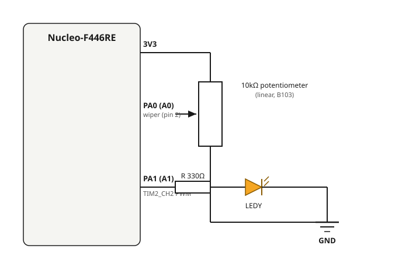

# 5.1 — ADC Single Channel + PWM LED (potentiometer → brightness)

**Board:** Nucleo-F446RE (STM32F446RETx)
**IDE:** STM32CubeIDE (GCC / make)

## What this project is about

A 10kΩ potentiometer is read on a single ADC channel, and its value directly controls the brightness of an LED through PWM — vặn biến trở, LED sáng/mờ theo thời gian thực. This is the first project in the repository combining two peripherals: **ADC** (reading an analog voltage) and **timer PWM** (generating an analog-like output).

This project was built from a real sample project found for the STM32F103 ("ADC Single + Multi"), but that sample's "multi-channel" technique was actually a **sequential polling trick**: it called a single-channel read function twice per loop with two different channel numbers, reconfiguring the ADC each time. That is not true hardware scan mode (which needs `ADC_SCAN_ENABLE` + DMA so the ADC hardware cycles channels on its own). This project instead builds true **single-channel ADC** from scratch on the F446RE, laid as the foundation before a future multi-channel version.

## How the ADC read works

The ADC is configured for **single conversion mode** (`ContinuousConvMode = DISABLE`), so every reading needs an explicit start/poll/stop cycle — the pattern repeats every loop iteration:

```c
HAL_ADC_Start(&hadc1);
HAL_ADC_PollForConversion(&hadc1, HAL_MAX_DELAY);   // blocks until EOC flag is set
adc_raw = HAL_ADC_GetValue(&hadc1);                  // read the DR register, 0-4095 (12-bit)
HAL_ADC_Stop(&hadc1);
```

`HAL_ADC_PollForConversion` blocks the CPU while the ADC hardware samples and converts — this is fine here since a single conversion takes only a few microseconds and the loop has nothing else time-critical to do.

## How the PWM output works

TIM2 channel 2 is configured once at startup (not re-started every loop):

```c
HAL_TIM_PWM_Start(&htim2, TIM_CHANNEL_2);   // called once, before while(1)
```

With `Prescaler = 89` and `Period (ARR) = 999`, the timer clock (90MHz APB1 timer clock ÷ 90) produces a 1kHz PWM signal. Every loop iteration just rewrites the compare register — the timer keeps outputting the PWM signal in hardware, no CPU polling needed for the output side:

```c
duty = adc_raw * 999 / 4095;                          // map 0-4095 -> 0-999
__HAL_TIM_SET_COMPARE(&htim2, TIM_CHANNEL_2, duty);    // writes TIM2->CCR2 directly
```

## Pin mapping

| Signal | Pin | Notes |
|---|---|---|
| Potentiometer wiper | PA0 (Arduino header **A0**), `ADC1_IN0` | Analog input, 12-bit, single channel, software-triggered |
| LEDY (PWM) | PA1 (Arduino header **A1**), `TIM2_CH2` | Alternate function output, 1kHz PWM |

## Wiring diagram



- Potentiometer (10kΩ linear, marked **B103**): outer pins to `3V3` and `GND` (either way round works — reversing them just flips which direction feels like "increase"), wiper (middle pin) to `PA0`.
- LEDY: `PA1` → resistor (~330Ω) → LED anode, LED cathode → `GND`.

## Debugging without UART: Live Expressions

`printf`-over-UART was tried and then removed to keep the project scoped to ADC+PWM only. Instead, `adc_raw` is inspected live during a debug session using CubeIDE's **Live Expressions** view, which polls a global/static variable's value over SWD while the target keeps running (no breakpoint needed):

1. Start a debug session, open `Window → Show View → Live Expressions`.
2. Add `adc_raw` (and `duty`) as an expression.
3. Toggle **Enable Live Watch** on the view's toolbar, then **Resume** the target.

## Mistakes made while building this (worth knowing about)

- **CubeMX generated for the wrong toolchain (EWARM/IAR)** the first time — STM32CubeIDE's Import wizard can't see a project without `.project`/`.cproject`. Fix: `Project Manager → Toolchain/IDE` must be set to `STM32CubeIDE` before generating.
- **`Copy all used libraries files`** (a Code Generator option in CubeMX) pulled in unrelated CMSIS submodules — `RTOS2`, `NN`, `DSP`, `Core/Template/ARMv8-M` — none of which are needed for a plain HAL project on a Cortex-M4, and each failed to compile (missing headers like `RTE_Components.h`, `dsp/transform_functions.h`) because their supporting middleware wasn't generated. Fix: switch to **`Copy only the necessary library files`**, regenerate, and delete the stray folders under `Drivers/CMSIS/` left behind from the earlier generation.
- **LED wired to the wrong header pin** — A4 (PC1) instead of A1 (PA1), the pin actually configured as `TIM2_CH2`. Always double check the Arduino header label against the real chip pin (A0=PA0, A1=PA1, A2=PA4, A3=PB0, A4=PC1, A5=PC0 — they are not in chip-pin order).
- **Potentiometer GND miswired** — reading stuck at a constant 4095 regardless of wiper position turned out to be a wrong GND connection on the potentiometer, not a code or ADC configuration bug. When a reading looks "stuck," isolate the ADC pin by touching it directly to GND and to 3V3 before suspecting the code.

## Folder structure

```
5_1_ADC_LED/
├── Core/Src/main.c   - MX_ADC1_Init, MX_TIM2_Init, while(1) loop reading ADC and writing PWM compare
├── 5_1_ADC_LED.ioc    - CubeMX project (ADC1 IN0 single channel, TIM2 CH2 PWM, Toolchain: STM32CubeIDE)
└── wiring_diagram.svg
```
